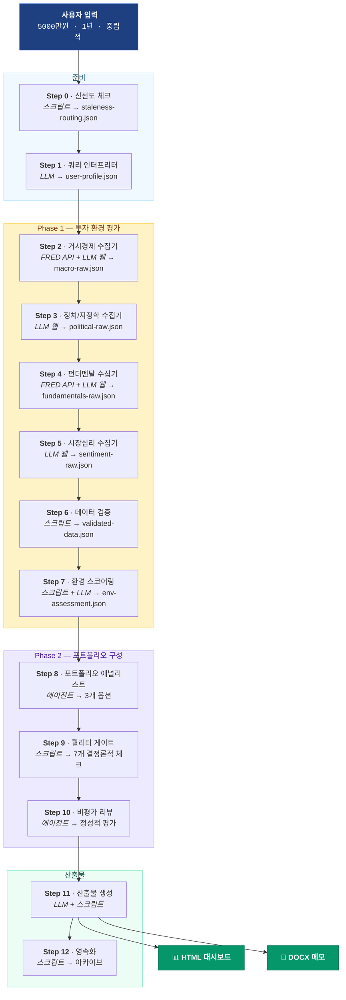

<p align="center">
  
  
  
  
</p>

#  투자 포트폴리오 어드바이저

> **Language / 언어**: [English](README.md) | 한국어

**AI 기반 개인 투자 매니저.** 거시경제부터 포트폴리오까지 탑다운 분석 — 며칠이 아닌 몇 분 만에.

예산, 투자 기간, 위험 성향만 알려주세요. 위험도별 3가지 포트폴리오 옵션과 인터랙티브 대시보드, 투자 메모를 돌려드립니다.

> **핵심 원칙**: 빈칸이 오답보다 낫다. 검증할 수 없는 숫자는 "—"로 표시 — 절대 날조하지 않습니다.

---

## 이게 뭐하는 건가요?

투자 목표를 자연어로 설명하면 됩니다. 시스템이 거시경제, 정치/지정학, 펀더멘탈, 시장심리 4개 차원을 **12단계 탑다운 분석**으로 평가한 뒤, 맞춤형 포트폴리오 3개를 구성합니다.

```
"5000만원, 1년, 중립적 위험 성향으로 포트폴리오 추천해줘"
"$100K, 3 years, aggressive — recommend a portfolio"
```

받게 되는 결과물:

| 산출물 | 형식 | 설명 |
|--------|------|------|
| **인터랙티브 대시보드** | HTML | 10개 섹션, Chart.js 시각화 포함 비교 대시보드 |
| **투자 메모** | DOCX | 환경 분석, 포트폴리오 상세, 리스크 분석 포함 종합 보고서 |
| **채팅 요약** | 텍스트 | 핵심 내용 인라인 제공 |

---

## 대시보드 미리보기

HTML 대시보드는 자체 완결형 파일 — 아무 브라우저에서나 열 수 있습니다. 서버 불필요.

| 섹션 | 내용 |
|------|------|
| **그라데이션 헤더** | 투자 예산 · 기간 · 위험 성향 · 레짐 분류 · 데이터 신뢰도 뱃지 |
| **환경 평가 카드** | 6개 차원 점수 (미국/한국 거시, 정치, 미국/한국 펀더멘탈, 심리) + 방향 화살표 |
| **3컬럼 비교** | 공격적 / 중립적 / 보수적 자산배분 테이블 나란히 비교 |
| **파이 차트** | 옵션별 자산배분 도넛 차트 (Chart.js) |
| **보유종목 테이블** | 티커 · 종목명 · 비중 · 투자 근거 · 출처 태그 |
| **리스크/수익 산점도** | 기대수익률 vs 하방 리스크 시각 비교 |
| **시나리오 카드** | 강세 / 기본 / 약세 수익률 — 글래스모피즘 카드, 그라데이션 배경 |
| **리스크 메커니즘 체인** | 리스크 → 포트폴리오 영향 → 대응 — 심각도별 컬러 코딩 |
| **리밸런싱 트리거** | 포트폴리오 조정이 필요한 조건들 |
| **다크 푸터** | 면책 조항 + 분석 메타데이터 |

---

## 12단계 파이프라인

전체 파이프라인이 순차적으로 실행됩니다. 각 단계마다 실행자, 성공 기준, 실패 대안이 정의되어 있습니다.



### LLM vs 스크립트 — 명확한 경계

모든 단계에 실행자가 지정되어 있습니다. "같은 입력 → 같은 결과?" → **스크립트**. 판단이 필요? → **LLM**.

| 단계 | 실행자 | 이유 |
|------|--------|------|
| 0. 신선도 체크 | 스크립트 | 타임스탬프 비교는 결정론적 |
| 1. 쿼리 해석 | LLM | 자연어 파싱 필요 |
| 2. 거시경제 수집 | FRED API + LLM | US 지표는 FRED API(Grade A), KR/Global은 웹 검색 |
| 3. 정치/지정학 수집 | LLM | 웹 리서치는 판단 필요 |
| 4. 펀더멘탈 수집 | FRED API + LLM | 크레딧 스프레드는 FRED API, 밸류에이션/섹터는 웹 |
| 5. 시장심리 수집 | LLM | 웹 리서치는 판단 필요 |
| 6. 데이터 검증 | 스크립트 | 산술 일관성, 등급 부여 |
| 7. 환경 스코어링 | 스크립트 + LLM | 역사적 범위 위치(스크립트) + 레짐 분류(LLM) |
| 8. 포트폴리오 구성 | 스크립트 + LLM | 배분 계산(스크립트) + 종목 선택(LLM) |
| 9. 퀄리티 게이트 | 스크립트 | 7개 결정론적 체크 |
| 10. 비평가 리뷰 | LLM | 정성적 판단 (3개 항목) |
| 11. 산출물 생성 | LLM + 스크립트 | HTML(LLM) + DOCX(스크립트) |
| 12. 영속화 | 스크립트 | 파일 아카이브 |

---

## 3개 에이전트 + 12개 스킬

### 에이전트

| 에이전트 | 역할 | 격리 수준 |
|----------|------|-----------|
| **environment-researcher** | 데이터 수집 전문가. 4개 수집기 순차 실행. 출처 태깅만 — 의견 없음. | 신선도 라우팅 읽고, raw JSON 쓰기 |
| **portfolio-analyst** | 핵심 분석 엔진. 6단계 구성: 레짐 → 배분 → 리스크 조정 → 기간 조정 → 종목 선택 → 수익 추정. | 환경 평가 + 사용자 프로필 읽기 |
| **critic** | 독립 정성적 리뷰어. 결과물만으로 판단 — 중간 산출물 전달 금지. | 3개 파일 경로만 수신 (포트폴리오, 프로필, 퀄리티 리포트) |

### 스킬

| # | 스킬 | 단계 | 유형 |
|---|------|------|------|
| 1 | staleness-checker | 0 | 스크립트 |
| 2 | query-interpreter | 1 | LLM |
| 3 | macro-collector | 2 | FRED API + LLM (웹) |
| 4 | political-collector | 3 | LLM (웹) |
| 5 | fundamentals-collector | 4 | FRED API + LLM (웹) |
| 6 | sentiment-collector | 5 | LLM (웹) |
| 7 | data-validator | 6 | 스크립트 |
| 8 | environment-scorer | 7 | 스크립트 + LLM |
| 9 | quality-gate | 9 | 스크립트 |
| 10 | portfolio-dashboard-generator | 11 | LLM |
| 11 | memo-generator | 11 | 스크립트 |
| 12 | data-manager | 12 | 스크립트 |

---

## 자산 클래스 & 커버리지

| 자산 클래스 | 시장 | 예시 |
|-------------|------|------|
| **미국 주식 / ETF** | NYSE, NASDAQ | VOO, VTI, SCHD, XLI, XLE, XLV, XLU |
| **한국 주식 / ETF** | KOSPI, KOSDAQ | 삼성전자, KODEX 200, KODEX 배당가치 |
| **채권** | 미국, 한국 | AGG, TIP, IEF, TLT, KODEX 국고채 |
| **대안투자** | 글로벌 | GLD (금) |
| **현금성 자산** | 미국, 한국 | SGOV, CMA 머니마켓 |

---

## 데이터 신뢰도 시스템

모든 데이터 포인트에 등급과 출처 태그가 붙습니다. 무엇을 믿을 수 있는지 항상 알 수 있습니다.

| 등급 | 기준 | 표시 |
|------|------|------|
| **A** | 정부 공식 통계 (FRED API 포함) + 산술 일관성 | `[Official]` |
| **B** | 2개+ 독립 소스, 5% 이내 차이 | `[Portal]` `[KR-Portal]` |
| **C** | 단일 소스, 산술 일관성 확인 | 출처 표기 |
| **D** | 검증 불가 → **"—"로 표시** | 절대 날조 안 함 |

```
미국 거시경제 예시:
  GDP 성장률: 2.3% [Official]        ← Grade A, BEA
  S&P 500 P/E: 26.6x [Portal]       ← Grade B, 교차 검증
  NYSE 마진부채: —                   ← Grade D, 제외

한국 거시경제 예시:
  GDP 성장률: 2.0% [Official]        ← Grade A, 한국은행
  KOSPI PER: 23.3x [KR-Portal]      ← Grade B, 네이버금융 + FnGuide
  기관 매매동향: —                    ← Grade D, 제외
```

---

## 레짐 기반 자산배분

포트폴리오는 환경 스코어링에서 도출된 **레짐 분류**를 기반으로 구성됩니다. 각 레짐은 배분 범위에 매핑되고, 위험 성향과 투자 기간으로 조정됩니다.

| 레짐 | 미국 주식 | 한국 주식 | 채권 | 대안투자 | 현금 |
|------|-----------|-----------|------|----------|------|
| 초기 확장 | 50–65% | 10–20% | 15–25% | 5–10% | 0–5% |
| 중기 사이클 | 40–55% | 10–15% | 20–30% | 5–10% | 5–10% |
| 후기 사이클 | 30–45% | 5–15% | 30–40% | 5–10% | 10–15% |
| 경기침체 | 20–35% | 5–10% | 35–50% | 5–10% | 15–25% |
| 회복기 | 45–60% | 15–20% | 15–25% | 5–10% | 5–10% |

**3단계 조정** 순차 적용:
1. **위험 성향** — 공격적은 상한, 보수적은 하한으로 밀기
2. **투자 기간** — 단기(<6개월): 현금 +10%, 주식 −10%. 장기(5년+): 주식 +10%
3. **환경** — 거시/정치/심리 신호에 따른 섹터 틸트

---

## 빠른 시작

### 사전 요구사항

- **Claude Code CLI** — `npm install -g @anthropic-ai/claude-code`
- **Python 3.11+** — 결정론적 스크립트 실행용

### 설치

```bash
# 저장소 클론
git clone <repo-url>
cd investment-portfolio-advisor

# 가상환경 생성 및 의존성 설치
python3 -m venv .venv
source .venv/bin/activate
pip install -r requirements.txt

# (선택) FRED API 키 설정 — US 거시경제 데이터 Grade A 수집 강화
# 무료 키 발급: https://fred.stlouisfed.org/docs/api/api_key.html
export FRED_API_KEY=your_api_key_here
```

### 실행

```bash
claude
```

Claude Code가 `CLAUDE.md`를 자동으로 읽습니다:

```
=== Investment Portfolio Advisor ===
Data Mode: Standard (Web-only)
Date: 2026-03-18
Ready. Describe your investment goals to begin.
(e.g., "50M KRW, 1 year, moderate risk tolerance")
```

### 예시 쿼리

```
5000만원, 1년, 중립적 위험 성향으로 포트폴리오 추천해줘
1억원, 5년, 공격적 — 미국 주식 위주로
$100K, 3 years, aggressive — recommend a portfolio
3000만원, 6개월, 보수적
```

---

## 출력 파일

모든 생성 파일은 `output/` 하위에 저장됩니다 (gitignored):

| 파일 | 설명 |
|------|------|
| `output/reports/portfolio_{lang}_{date}.html` | 인터랙티브 HTML 대시보드 |
| `output/reports/portfolio_{lang}_{date}.docx` | 투자 메모 (Word) |
| `output/user-profile.json` | 파싱된 사용자 투자 프로필 |
| `output/environment-assessment.json` | 6차원 환경 점수 + 레짐 |
| `output/portfolio-recommendation.json` | 3개 포트폴리오 옵션 (보유종목/시나리오) |
| `output/quality-report.json` | 7개 퀄리티 게이트 결과 |
| `output/critic-report.json` | 정성적 리뷰 (3개 항목) |
| `output/data/{차원}/` | 차원별 원본 + 검증 데이터 |
| `output/data/recommendations/` | 날짜별 추천 아카이브 |

---

## 품질 & 안전장치

### 퀄리티 게이트 (7개 결정론적 체크)

| # | 항목 | 통과 기준 |
|---|------|-----------|
| 1 | 배분 합계 | 각 옵션 정확히 100% |
| 2 | 출처 태그 커버리지 | 보유종목의 ≥ 80%에 출처 태그 |
| 3 | 필수 필드 | 스키마의 모든 필수 필드 존재 |
| 4 | 면책조항 | 비어있지 않은 면책 문자열 |
| 5 | Grade D 제외 준수 | 보유종목에 Grade D 항목 0개 |
| 6 | 사용자 프로필 반영 | 예산/기간/위험성향이 결과에 반영 |
| 7 | 옵션 차별화 | 3개 옵션 간 주식 비중 최소 10%p 차이 |

### 비평가 리뷰 (3개 정성적 항목)

| # | 항목 | 질문 |
|---|------|------|
| 1 | 사용자 맞춤성 | 진짜 맞춤형인가, 아니면 뻔한 추천인가? |
| 2 | 메커니즘 체인 | 모든 리스크에 인과관계가 있는가? |
| 3 | 옵션 차별화 | 옵션 간 숫자만 다른 게 아니라 논리가 다른가? |

### 신선도 기반 데이터 재활용

파라미터를 바꿔서 다시 실행? 재수집 전에 데이터 신선도를 먼저 확인합니다:

| 차원 | 재활용 조건 | 재수집 조건 |
|------|------------|------------|
| 거시경제 | 24시간 미만 | 24시간 이상 |
| 정치/지정학 | 7일 미만 | 7일 이상 |
| 펀더멘탈 | 3일 미만 | 3일 이상 |
| 시장심리 | 12시간 미만 | 12시간 이상 |

---

## 장애 대응

시스템은 문제가 생겨도 항상 무언가를 전달하도록 설계되었습니다.

| 장애 상황 | 대응 |
|-----------|------|
| 웹 검색 실패 | 1회 재시도 → Grade D ("—") 처리 |
| 검증 스크립트 오류 | 일괄 Grade C 부여, 계속 진행 |
| 배분 합계 ≠ 100% | 계산 스크립트 재실행 |
| 비평가 타임아웃 (2분) | 건너뛰기, `[No critic review]` 플래그 부착 |
| 비평가 FAIL 판정 | 패치 → 재리뷰 (최대 1회) |
| HTML 생성 실패 | 1회 재시도 |
| DOCX 생성 실패 | HTML만 전달, 메모 텍스트는 채팅으로 |
| 전체 파이프라인 타임아웃 (15분) | 부분 결과물 전달 |

---

## 프로젝트 구조

```
investment-portfolio-advisor/
├── CLAUDE.md                              ← 마스터 오케스트레이터
├── .mcp.json                              ← MCP 설정
├── requirements.txt                       ← Python 의존성
├── pytest.ini                             ← 테스트 설정
│
├── references/                            ← 참조 자료
│   ├── allocation-framework.md            ← 레짐 → 배분 매핑
│   ├── asset-universe.md                  ← 승인된 티커/ETF/채권 유니버스
│   ├── macro-indicator-ranges.md          ← 스코어링용 역사적 범위
│   ├── portfolio-construction-rules.md    ← 분산투자 제약
│   └── output-templates/
│       ├── dashboard-template.md          ← HTML 스켈레톤 + 섹션 패턴
│       ├── color-system.md                ← 라이트 테마 + 브랜드 컬러 + Chart.js
│       └── memo-template.md              ← DOCX 섹션 구조
│
├── output/                                ← 런타임 산출물 (gitignored)
│   ├── reports/                           ← HTML 대시보드 + DOCX 메모
│   ├── data/{차원}/                       ← 차원별 원본 + latest JSON
│   └── data/recommendations/              ← 추천 아카이브
│
├── tests/scripts/                         ← 전체 Python 스크립트 단위 테스트
│
└── .claude/
    ├── settings.json
    ├── scripts/
    │   └── fred_client.py                ← 공유 FRED API 클라이언트 (거시경제 + 펀더멘탈)
    ├── skills/                            ← 12개 스킬 (SKILL.md + scripts/)
    │   ├── staleness-checker/
    │   ├── query-interpreter/
    │   ├── macro-collector/
    │   ├── political-collector/
    │   ├── fundamentals-collector/
    │   ├── sentiment-collector/
    │   ├── data-validator/
    │   ├── environment-scorer/
    │   ├── quality-gate/
    │   ├── portfolio-dashboard-generator/
    │   ├── memo-generator/
    │   └── data-manager/
    └── agents/                            ← 3개 서브에이전트 (AGENT.md)
        ├── environment-researcher/
        ├── portfolio-analyst/
        └── critic/
```

---

## 테스트 실행

```bash
source .venv/bin/activate
pytest tests/ -v
```

9개 Python 스크립트 각각 전용 단위 테스트 포함:

| 스크립트 | 테스트 범위 |
|----------|------------|
| `fred_client.py` | FRED API 호출, 시리즈 매핑, 기간 포맷팅, 단위 변환 |
| `allocation_calculator.py` | 레짐 → 배분 범위, 리스크/기간 조정 |
| `return_estimator.py` | 시나리오별 기대수익률 계산 |
| `data_validator.py` | 3단계 검증 + 등급 부여 |
| `environment_scorer.py` | 역사적 범위 대비 위치 |
| `quality_gate.py` | 7개 결정론적 품질 체크 |
| `staleness_checker.py` | 차원별 신선도 평가 |
| `docx_generator.py` | DOCX 메모 생성 |
| `recommendation_archiver.py` | 스냅샷 아카이브 + latest.json 업데이트 |

---

## 관련 프로젝트

| 프로젝트 | 범위 | 접근법 |
|----------|------|--------|
| **[stock-analysis-agent](https://github.com/kipeum86/stock-analysis-agent)** | 개별 종목 심층 분석 | 바텀업 (기업 → 밸류에이션) |
| **investment-portfolio-advisor** *(현재)* | 멀티에셋 포트폴리오 구성 | 탑다운 (거시경제 → 포트폴리오) |

향후 Phase 5에서 두 프로젝트 통합 예정 — 포트폴리오 추천 내에서 개별 종목 심층 분석 크로스 호출.

---

## 향후 로드맵

| Phase | 기능 | 상태 |
|-------|------|------|
| **1** | 포트폴리오 추천 엔진 | ✅ 완료 |
| 1.5 | 병렬 수집 | 계획됨 |
| 2 | 리밸런싱 어드바이저 | 계획됨 |
| 3 | 세금 최적화 | 계획됨 |
| 4 | 성과 추적 | 계획됨 |
| 5 | stock-analysis-agent 통합 | 계획됨 |

---

## 면책 조항

**이 도구는 정보 제공 목적으로만 제작되었습니다. 투자 권유, 증권 매매 권유, 또는 투자 수익 보장을 구성하지 않습니다.**

- 모든 분석은 AI가 생성하며 오류를 포함할 수 있습니다
- 시간에 민감한 데이터는 1차 소스에서 확인한 후 행동하세요
- 과거 성과 데이터는 미래 결과를 예측하지 않습니다
- 투자 결정 전 반드시 자격 있는 금융 전문가와 상담하세요

데이터 신뢰도 시스템(Grade D → "—")은 데이터 오류 위험을 줄이지만 완전히 제거하지는 않습니다. 모든 결과물을 독립적으로 검증하세요.

---

<p align="center">
  <sub><a href="https://claude.ai/claude-code">Claude Code</a>로 제작 · Powered by Claude</sub>
</p>
