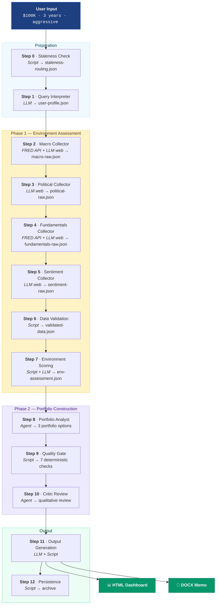

<p align="center">
  
  
  
  
</p>

#  Investment Portfolio Advisor

> **Language / 언어**: English | [한국어](README.ko.md)

**Your personal AI investment manager.** Top-down macro-to-portfolio analysis — delivered in minutes, not days.

Give it your budget, timeline, and risk appetite. Get back 3 risk-differentiated portfolio options with an interactive dashboard and a professional investment memo.

> **Core principle**: Blank beats wrong. If a number can't be verified, it shows as "—" — never fabricated.

---

## What Does This Do?

You describe your investment goals in plain language. The system performs a **12-step top-down analysis** spanning macroeconomic, political, fundamental, and sentiment dimensions — then constructs 3 tailored portfolios.

```
"5000만원, 1년, 중립적 위험 성향으로 포트폴리오 추천해줘"
"$100K, 3 years, aggressive — recommend a portfolio"
```

What you get back:

| Output | Format | Description |
|--------|--------|-------------|
| **Interactive Dashboard** | HTML | 10-section comparison with Chart.js visualizations |
| **Investment Memo** | DOCX | Full written analysis — environment, portfolios, risks |
| **Chat Summary** | Text | Key findings delivered inline |

---

## Dashboard Preview

The HTML dashboard is a self-contained file — open it in any browser. No server required.

| Section | What's Inside |
|---------|---------------|
| **Gradient Header** | Budget · horizon · risk tolerance · regime classification · data confidence badge |
| **Environment Cards** | 6 dimension scores (Macro US/KR, Political, Fundamentals US/KR, Sentiment) with direction arrows |
| **3-Column Comparison** | Side-by-side allocation tables — Aggressive / Moderate / Conservative |
| **Pie Charts** | Asset allocation doughnut charts per option (Chart.js) |
| **Holdings Tables** | Ticker · Name · Weight · Rationale · Source Tag per option |
| **Risk/Return Scatter** | Visual comparison of expected return vs. downside risk |
| **Scenario Cards** | Bull / Base / Bear returns with glassmorphism cards on gradient background |
| **Risk Mechanism Chains** | Risk → Portfolio Impact → Response Action — color-coded by severity |
| **Rebalancing Triggers** | Conditions that should prompt portfolio adjustments |
| **Dark Footer** | Disclaimer + analysis metadata |

---

## 12-Step Pipeline

The full pipeline runs sequentially — every step has a defined executor, success criteria, and failure fallback.



### LLM vs Script — Clear Boundaries

Every step has an explicitly designated executor. "Same input → same output?" → **Script**. Requires judgment? → **LLM**.

| Step | Executor | Rationale |
|------|----------|-----------|
| 0. Staleness Check | Script | Timestamp comparison is deterministic |
| 1. Query Interpreter | LLM | Natural language parsing |
| 2. Macro Collector | FRED API + LLM | US indicators via FRED API (Grade A), KR/Global via web search |
| 3. Political Collector | LLM | Web research requires judgment |
| 4. Fundamentals Collector | FRED API + LLM | Credit spreads via FRED API, valuations/sectors via web |
| 5. Sentiment Collector | LLM | Web research requires judgment |
| 6. Data Validation | Script | Arithmetic consistency, grade assignment |
| 7. Environment Scoring | Script + LLM | Historical range positioning (script) + regime classification (LLM) |
| 8. Portfolio Construction | Script + LLM | Allocation math (script) + holding selection (LLM) |
| 9. Quality Gate | Script | 7 deterministic checks |
| 10. Critic Review | LLM | Qualitative judgment (3 items) |
| 11. Output Generation | LLM + Script | HTML (LLM) + DOCX (script) |
| 12. Persistence | Script | File archival |

---

## 3 Agents + 12 Skills

### Agents

| Agent | Role | Isolation |
|-------|------|-----------|
| **environment-researcher** | Data collection specialist. Runs 4 collectors sequentially. Source tagging only — no opinions. | Reads staleness routing, writes raw JSON |
| **portfolio-analyst** | Core analysis engine. 6-stage construction: regime → allocation → risk adjust → horizon adjust → holdings → returns. | Reads environment assessment + user profile |
| **critic** | Independent qualitative reviewer. Judges from outputs only — no intermediate artifacts passed. | Receives only 3 file paths (portfolio, profile, quality report) |

### Skills

| # | Skill | Step | Type |
|---|-------|------|------|
| 1 | staleness-checker | 0 | Script |
| 2 | query-interpreter | 1 | LLM |
| 3 | macro-collector | 2 | FRED API + LLM (web) |
| 4 | political-collector | 3 | LLM (web) |
| 5 | fundamentals-collector | 4 | FRED API + LLM (web) |
| 6 | sentiment-collector | 5 | LLM (web) |
| 7 | data-validator | 6 | Script |
| 8 | environment-scorer | 7 | Script + LLM |
| 9 | quality-gate | 9 | Script |
| 10 | portfolio-dashboard-generator | 11 | LLM |
| 11 | memo-generator | 11 | Script |
| 12 | data-manager | 12 | Script |

---

## Asset Classes & Coverage

| Asset Class | Markets | Examples |
|-------------|---------|----------|
| **US Equities / ETFs** | NYSE, NASDAQ | VOO, VTI, SCHD, XLI, XLE, XLV, XLU |
| **KR Equities / ETFs** | KOSPI, KOSDAQ | 삼성전자, KODEX 200, KODEX 배당가치 |
| **Bonds** | US, KR | AGG, TIP, IEF, TLT, KODEX 국고채 |
| **Alternatives** | Global | GLD (Gold) |
| **Cash Equivalents** | US, KR | SGOV, CMA 머니마켓 |

---

## Data Confidence System

Every data point carries a grade and source tag. You always know what to trust.

| Grade | Criteria | Display |
|-------|----------|---------|
| **A** | Official government statistics (incl. FRED API) + arithmetic consistency | `[Official]` |
| **B** | 2+ independent sources within 5% difference | `[Portal]` `[KR-Portal]` |
| **C** | Single source, arithmetic consistency confirmed | Source noted |
| **D** | Unverifiable → **shown as "—"** | Never fabricated |

```
US Macro example:
  GDP Growth: 2.3% [Official]        ← Grade A, BEA
  S&P 500 P/E: 26.6x [Portal]       ← Grade B, cross-referenced
  NYSE Margin Debt: —                ← Grade D, excluded

KR Macro example:
  GDP 성장률: 2.0% [Official]         ← Grade A, 한국은행
  KOSPI PER: 23.3x [KR-Portal]       ← Grade B, 네이버금융 + FnGuide
  기관 매매동향: —                     ← Grade D, excluded
```

---

## Regime-Based Allocation

Portfolios are built on a **regime classification** derived from environment scoring. Each regime maps to allocation ranges, then adjusted for risk tolerance and investment horizon.

| Regime | US Equity | KR Equity | Bonds | Alternatives | Cash |
|--------|-----------|-----------|-------|-------------|------|
| Early Expansion | 50–65% | 10–20% | 15–25% | 5–10% | 0–5% |
| Mid-Cycle | 40–55% | 10–15% | 20–30% | 5–10% | 5–10% |
| Late-Cycle | 30–45% | 5–15% | 30–40% | 5–10% | 10–15% |
| Recession | 20–35% | 5–10% | 35–50% | 5–10% | 15–25% |
| Recovery | 45–60% | 15–20% | 15–25% | 5–10% | 5–10% |

**3 adjustment layers** applied sequentially:
1. **Risk Tolerance** — Aggressive pushes to upper bound, Conservative to lower
2. **Investment Horizon** — Short (<6m): cash +10%, equities −10%. Long (5y+): equities +10%
3. **Environment** — Sector tilts based on macro/political/sentiment signals

---

## Quick Start

### Prerequisites

- **Claude Code CLI** — `npm install -g @anthropic-ai/claude-code`
- **Python 3.11+** — for deterministic scripts

### Setup

```bash
# Clone the repository
git clone <repo-url>
cd investment-portfolio-advisor

# Create virtual environment and install dependencies
python3 -m venv .venv
source .venv/bin/activate
pip install -r requirements.txt

# (Optional) Set FRED API key for enhanced US macro data (Grade A)
# Get a free key at https://fred.stlouisfed.org/docs/api/api_key.html
export FRED_API_KEY=your_api_key_here
```

### Run

```bash
claude
```

Claude Code reads `CLAUDE.md` automatically. You'll see:

```
=== Investment Portfolio Advisor ===
Data Mode: Standard (Web-only)
Date: 2026-03-18
Ready. Describe your investment goals to begin.
(e.g., "50M KRW, 1 year, moderate risk tolerance")
```

### Example Queries

```
5000만원, 1년, 중립적 위험 성향으로 포트폴리오 추천해줘
$100K, 3 years, aggressive — recommend a portfolio
$50K, 6 months, conservative
1억원, 5년, 공격적 — 미국 주식 위주로
```

---

## Output Files

All generated files go under `output/` (gitignored):

| File | Description |
|------|-------------|
| `output/reports/portfolio_{lang}_{date}.html` | Interactive HTML dashboard |
| `output/reports/portfolio_{lang}_{date}.docx` | Investment memo (Word) |
| `output/user-profile.json` | Parsed user investment profile |
| `output/environment-assessment.json` | 6-dimension environment scores + regime |
| `output/portfolio-recommendation.json` | 3 portfolio options with holdings/scenarios |
| `output/quality-report.json` | 7-check quality gate results |
| `output/critic-report.json` | Qualitative review (3 items) |
| `output/data/{dimension}/` | Raw + validated data per dimension |
| `output/data/recommendations/` | Archived recommendations by date |

---

## Quality & Safety

### Quality Gate (7 Deterministic Checks)

| # | Check | Pass Criteria |
|---|-------|---------------|
| 1 | Allocation sum | Each option totals exactly 100% |
| 2 | Source tag coverage | ≥ 80% of holdings have source tags |
| 3 | Required fields | All schema fields present |
| 4 | Disclaimer present | Non-empty disclaimer string |
| 5 | Grade D exclusion | No Grade D items in holdings |
| 6 | User profile reflected | Budget/period/risk match output |
| 7 | Option differentiation | ≥ 10pp equity weight difference across options |

### Critic Review (3 Qualitative Items)

| # | Item | Question |
|---|------|----------|
| 1 | User-Specificity | Is this genuinely tailored, or generic? |
| 2 | Mechanism Chains | Does every risk have a sound causal chain? |
| 3 | Option Differentiation | Do options differ in logic, not just numbers? |

### Staleness-Aware Data Reuse

Re-running with different parameters? The system checks data freshness before re-collecting:

| Dimension | Reuse if | Re-collect if |
|-----------|----------|---------------|
| Macroeconomic | < 24 hours old | ≥ 24 hours |
| Political | < 7 days old | ≥ 7 days |
| Fundamentals | < 3 days old | ≥ 3 days |
| Sentiment | < 12 hours old | ≥ 12 hours |

---

## Failure Handling

The system is designed to always deliver something, even when things go wrong.

| Failure | Response |
|---------|----------|
| Web search fails | Retry once → Grade D ("—") treatment |
| Validation script crashes | Blanket Grade C, proceed |
| Allocation sum ≠ 100% | Re-run calculator script |
| Critic times out (2 min) | Skip, attach `[No critic review]` flag |
| Critic fails portfolio | Patch → re-review (max 1 iteration) |
| HTML generation fails | Retry once |
| DOCX generation fails | Deliver HTML only, output memo in chat |
| Full pipeline timeout (15 min) | Deliver partial output |

---

## Project Structure

```
investment-portfolio-advisor/
├── CLAUDE.md                              ← Master orchestrator
├── .mcp.json                              ← MCP configuration
├── requirements.txt                       ← Python dependencies
├── pytest.ini                             ← Test configuration
│
├── references/                            ← Reference materials
│   ├── allocation-framework.md            ← Regime → allocation mapping
│   ├── asset-universe.md                  ← Approved ticker/ETF/bond universe
│   ├── macro-indicator-ranges.md          ← Historical ranges for scoring
│   ├── portfolio-construction-rules.md    ← Diversification constraints
│   └── output-templates/
│       ├── dashboard-template.md          ← HTML skeleton + section patterns
│       ├── color-system.md                ← Light theme + brand colors + Chart.js
│       └── memo-template.md              ← DOCX section structure
│
├── output/                                ← Runtime artifacts (gitignored)
│   ├── reports/                           ← HTML dashboard + DOCX memo
│   ├── data/{dimension}/                  ← Raw + latest JSON per dimension
│   └── data/recommendations/              ← Archived recommendations
│
├── tests/scripts/                         ← Unit tests for all Python scripts
│
└── .claude/
    ├── settings.json
    ├── scripts/
    │   └── fred_client.py                ← Shared FRED API client (macro + fundamentals)
    ├── skills/                            ← 12 skills (SKILL.md + scripts/)
    │   ├── staleness-checker/
    │   ├── query-interpreter/
    │   ├── macro-collector/
    │   ├── political-collector/
    │   ├── fundamentals-collector/
    │   ├── sentiment-collector/
    │   ├── data-validator/
    │   ├── environment-scorer/
    │   ├── quality-gate/
    │   ├── portfolio-dashboard-generator/
    │   ├── memo-generator/
    │   └── data-manager/
    └── agents/                            ← 3 sub-agents (AGENT.md)
        ├── environment-researcher/
        ├── portfolio-analyst/
        └── critic/
```

---

## Running Tests

```bash
source .venv/bin/activate
pytest tests/ -v
```

9 Python scripts, each with dedicated unit tests:

| Script | Coverage |
|--------|----------|
| `fred_client.py` | FRED API fetch, series mapping, period formatting, transforms |
| `allocation_calculator.py` | Regime → allocation ranges, risk/horizon adjustments |
| `return_estimator.py` | Per-scenario expected return calculation |
| `data_validator.py` | 3-stage validation + grade assignment |
| `environment_scorer.py` | Historical range positioning |
| `quality_gate.py` | 7 deterministic quality checks |
| `staleness_checker.py` | Per-dimension freshness evaluation |
| `docx_generator.py` | DOCX memo generation |
| `recommendation_archiver.py` | Snapshot archival + latest.json updates |

---

## Related Projects

| Project | Scope | Approach |
|---------|-------|----------|
| **[stock-analysis-agent](https://github.com/kipeum86/stock-analysis-agent)** | Individual stock deep dives | Bottom-up (company → valuation) |
| **investment-portfolio-advisor** *(this)* | Multi-asset portfolio construction | Top-down (macro → portfolio) |

Future Phase 5 plans to integrate both — cross-invoke stock-analysis-agent for individual ticker deep dives within portfolio recommendations.

---

## Future Roadmap

| Phase | Feature | Status |
|-------|---------|--------|
| **1** | Portfolio Recommendation Engine | ✅ Complete |
| 1.5 | Parallel Collection | Planned |
| 2 | Rebalancing Advisor | Planned |
| 3 | Tax Optimization | Planned |
| 4 | Performance Tracking | Planned |
| 5 | stock-analysis-agent Integration | Planned |

---

## Disclaimer

**This tool is for informational purposes only. It does not constitute investment advice, a solicitation to buy or sell any security, or a guarantee of investment returns.**

- All analysis is AI-generated and may contain errors
- Verify time-sensitive data with primary sources before acting
- Past performance data does not predict future results
- Always consult a qualified financial advisor before making investment decisions

The data confidence system (Grade D → "—") reduces but does not eliminate the risk of errors. Independently verify all outputs.

---

## License

Licensed under the [Apache License, Version 2.0](LICENSE).

---

<p align="center">
  <sub>Built with <a href="https://claude.ai/claude-code">Claude Code</a> · Powered by Claude</sub>
</p>
